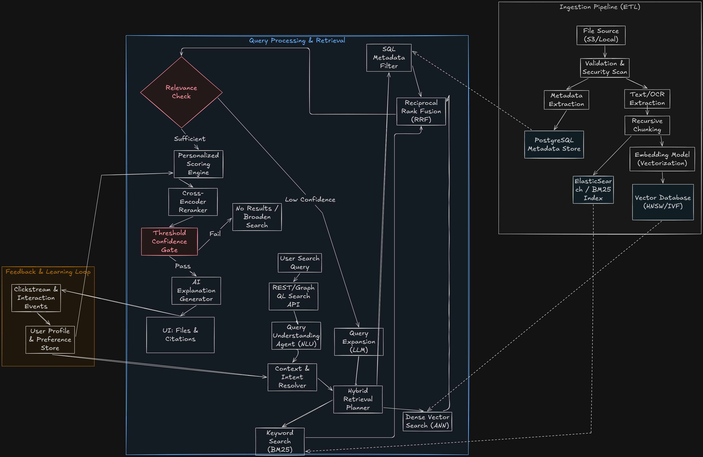

# Intelligent File Recommendation

An incremental, local-first implementation of the file discovery architecture. It indexes supported local documents, routes queries across lexical and optional semantic retrieval, and personalizes results using supplied working context and recorded activity.

See the [project blueprint](docs/project-blueprint.md) for canonical intent,
target architecture, implementation snapshot, and delivery plan. The
[feature-status matrix](docs/feature-status.md) provides a shorter status view.



## Run locally

Use Python 3.11 or newer. Install the project and start the API:

```bash
python3 -m venv .venv
source .venv/bin/activate
pip install -e '.[dev,documents]'
uvicorn file_recommender.api:app --reload
```

The API listens on `http://127.0.0.1:8000`; interactive API documentation is at `/docs`.

### Authentication and File Permissions

The API remains open for local development when no auth mode is configured. Static tokens are convenient for local multi-user testing; use OIDC JWT verification when integrating an identity provider.

For static local tokens, configure a JSON map from user IDs to unique private tokens of at least 16 characters:

```bash
export FILE_RECOMMENDER_AUTH_TOKENS='{"alice":"replace-with-a-long-random-token","bob":"replace-with-another-long-random-token"}'
uvicorn file_recommender.api:app --reload
```

Use a secret manager or private environment injection outside local development; never commit real tokens. Authenticated indexing makes the caller the file owner. Search and file-open events are scoped to that principal, and any supplied `user_id` must match it. Files owned by another user are skipped during re-indexing rather than overwritten.

Owners can grant and revoke read access for another user principal with `POST /permissions` and `DELETE /permissions` (static-token mode only accepts configured users):

```bash
curl -X POST http://127.0.0.1:8000/permissions \
  -H 'Authorization: Bearer <alice-token>' \
  -H 'Content-Type: application/json' \
  -d '{"path":"/path/to/your/files/plan.md","target_user_id":"bob"}'

curl -X DELETE http://127.0.0.1:8000/permissions \
  -H 'Authorization: Bearer <alice-token>' \
  -H 'Content-Type: application/json' \
  -d '{"path":"/path/to/your/files/plan.md","target_user_id":"bob"}'
```

For an external OIDC provider, install the auth extra and configure the API audience, exact issuer, and provider JWKS URL:

```bash
pip install -e '.[auth]'
export FILE_RECOMMENDER_OIDC_ISSUER='https://identity.example.com/'
export FILE_RECOMMENDER_OIDC_AUDIENCE='file-recommender-api'
export FILE_RECOMMENDER_OIDC_JWKS_URL='https://identity.example.com/.well-known/jwks.json'
uvicorn file_recommender.api:app --reload
```

OIDC mode accepts RS256-signed bearer JWT access tokens and validates issuer, audience, expiration, and subject against keys fetched from the configured HTTPS JWKS URL. The verified `sub` becomes the ACL principal. Opaque tokens and interactive login flows are not implemented. Configure either OIDC or the static token map, not both. Existing documents without ACL entries are hidden until indexed by an authenticated owner.

Use HTTPS and deployment-managed configuration/secrets outside local development. OIDC key sets are cached and refreshed by PyJWT; provider outages fail closed with `503` rather than bypassing authentication.

Index a local directory:

```bash
curl -X POST http://127.0.0.1:8000/index \
  -H 'Content-Type: application/json' \
  -d '{"directory":"/path/to/your/files"}'
```

Search the indexed files:

```bash
curl -X POST http://127.0.0.1:8000/search \
  -H 'Content-Type: application/json' \
  -d '{"query":"project launch notes","user_id":"local-user"}'
```

Pass the active project directory to apply a small working-context preference:

```bash
curl -X POST http://127.0.0.1:8000/search \
  -H 'Content-Type: application/json' \
  -d '{"query":"project launch notes","user_id":"local-user","context_directory":"/path/to/your/files/current-project"}'
```

The context directory must exist. It is used only for path-proximity scoring; the API does not scan it or send its contents to a model.

`.txt`, `.md`, `.rst`, `.docx`, `.pdf`, `.xlsx`, and `.pptx` files up to 1 MiB are indexed. Office/PDF support requires the `documents` extra shown above. Extraction caps text at 500,000 characters, limits PDFs to 200 pages and presentations to 200 slides, and reads at most 50,000 spreadsheet cells. Office ZIP archives are limited to 20 MiB uncompressed and 2,000 members, with a maximum compression ratio of 100. Malformed, empty, encrypted, oversized, hidden, and unsupported files are skipped. The database defaults to `.file-recommender/index.sqlite3`; set `FILE_RECOMMENDER_DB` to change it. Keyword search works locally without model credentials.

## Current retrieval scope

- Filename search for explicit filename queries.
- Metadata filters using `type:md`, `ext:txt`, `after:YYYY-MM-DD`, and `before:YYYY-MM-DD`.
- Full-text keyword search backed by SQLite FTS5.
- Chunk-level keyword and semantic matching using 1,000-character windows with 150-character overlap; results are fused and returned at file level.
- Hybrid filename and full-text candidate ranking for longer natural-language queries; semantic candidates join when embeddings are enabled.
- Confidence scoring from candidate relevance and query-term coverage, with one bounded synonym/stop-word expansion retry for low-confidence non-metadata searches.
- Optional semantic search through a local Sentence Transformers model, with vectors cached by file content and model id.
- Optional ambiguity-aware cross-encoder reranking of up to 30 candidates; confident results and single-candidate searches skip this cost.
- Personalized ranking from file-access frequency and recency, preferred extensions and topics, and per-file UTC hour/weekday patterns.
- A derived user profile endpoint for frequently accessed files, preferred extensions, topics, and active time patterns.

Search responses include a `confidence` value from `0.0` to `1.0` and an `expanded_query` field. When initial confidence is below `0.6`, the service may remove common filler words and add a small set of local synonyms, then retry once using hybrid retrieval. Metadata-filter searches are not expanded. No recursive retries are performed.

Search responses also include pipeline diagnostics: candidate count, whether reranking ran, the rerank decision, and end-to-end latency in milliseconds. With a cross-encoder configured, reranking runs only when at least two candidates remain and confidence is below `0.72` or the top-two score margin is within 12%. If the reranker fails, the service keeps the retrieval ranking.

Enable local semantic retrieval by installing the optional dependency and setting a model before starting the API:

```bash
pip install -e '.[semantic]'
export FILE_RECOMMENDER_MODEL=sentence-transformers/all-MiniLM-L6-v2
export FILE_RECOMMENDER_RERANKER_MODEL=cross-encoder/ms-marco-MiniLM-L-6-v2
uvicorn file_recommender.api:app --reload
```

Sentence Transformers downloads each selected model when enabled. The first indexing pass embeds supported files; unchanged files reuse cached vectors. Queries asking for related meaning (for example, `similar to driving`) use semantic-only retrieval. Longer natural-language queries fuse semantic, filename, and keyword candidates. When `FILE_RECOMMENDER_RERANKER_MODEL` is set, an ambiguity-aware cross-encoder may rerank the top 30 candidates and its result is reflected in the explanation. Without these settings, semantic retrieval and reranking remain disabled.

Enable optional LLM query understanding by configuring an OpenAI-compatible chat-completions endpoint:

```bash
export FILE_RECOMMENDER_LLM_API_KEY='your-provider-key'
export FILE_RECOMMENDER_LLM_MODEL='your-model-name'
export FILE_RECOMMENDER_LLM_BASE_URL='https://api.openai.com/v1'
uvicorn file_recommender.api:app --reload
```

The analyzer runs only for longer queries already routed to hybrid search, sends only the user query (never indexed file contents), and has a 3-second timeout. Its route proposal must match capabilities enabled in the app; unsupported or failed analyses fall back to the local planner. Use a provider whose data handling is appropriate for your queries.

Record file opens to build a local usage profile and supply personalization signals during search:

```bash
curl -X POST http://127.0.0.1:8000/access \
  -H 'Content-Type: application/json' \
  -d '{"user_id":"local-user","path":"/path/to/your/files/plan.md"}'

curl http://127.0.0.1:8000/users/local-user/profile
```

Profiles are derived from recorded access events when requested; the service does not persist a separate profile record. Ranking explanations identify when access history, file-type/topic preference, recency, or matching UTC time patterns influenced a result.

Search as a user to persist recommendation impressions. Each result includes a `recommendation_id`; submit feedback against that ID to personalize later searches:

```bash
curl -X POST http://127.0.0.1:8000/feedback \
  -H 'Content-Type: application/json' \
  -d '{"user_id":"local-user","recommendation_id":12,"feedback":"relevant"}'
```

Use `not_relevant` to downrank a result on future matching searches. Feedback is tied to the user who received the recommendation, and aggregate counts appear in the profile response.

## Audit log

The local SQLite audit trail records completed indexing, searches, file opens, and recommendation feedback. It stores event type, time, caller-supplied actor ID, internal resource IDs, and limited operational metadata. Raw queries, full file paths, document contents, and credentials are not written to the audit trail.

Enable the read-only audit endpoint by setting a private shared token before starting the API:

```bash
export FILE_RECOMMENDER_AUDIT_TOKEN='set-a-private-local-token'
uvicorn file_recommender.api:app --reload
```

Then list or filter events with `GET /audit`, using the `X-Audit-Token` header. Optional filters are `actor_id`, `event_type`, and `limit` (maximum 500). The token is a local operational control, not a replacement for user authentication. Actor IDs are caller-asserted until authentication is implemented. SQLite triggers block normal update/delete statements, but this local log is not cryptographically tamper-proof and should not be treated as a production compliance audit system.

## Retrieval Evaluation

Run the included local smoke corpus against the current lexical retrieval pipeline:

```bash
python -m file_recommender.evaluation \
  --documents tests/fixtures/evaluation/documents \
  --judgments tests/fixtures/evaluation/judgments.json \
  --k 3
```

The evaluator builds a temporary SQLite index and prints JSON containing Recall@k, MRR@k, nDCG@k, aggregate and per-planned-route median/p95 retrieval latency and ranking metrics, route counts, and per-query results. Judgments list relevant filenames in `relevant_files`. The bundled 22-query corpus covers 15 synthetic documents, including hybrid, filename, and metadata routes, multi-relevant queries, and near-topic confounders. Hybrid retrieval fuses filename, FTS5, optional semantic ranks, and query-term coverage with reciprocal-rank fusion. The current lexical baseline reports Recall@3 1.00, MRR@3 1.0000, and nDCG@3 0.9964 on this set. One multi-relevant travel/budget query still places its second relevant file below a related onboarding result. This is a regression set, not a reviewed real-user corpus or evidence of production retrieval quality.

An expanded 30-query authored synthetic benchmark includes `expected_strategy`
labels and explicit no-match cases. The corpus is labeled with provenance
metadata declaring it was authored from the existing fixture docs. It runs
without an embedding model, so its route metrics do not claim semantic routing.
It reports `route_accuracy` and `no_match_false_positive_rate` separately from
ranking metrics. Queries labeled as no-match are excluded from aggregate
relevance-ranking metrics:

```bash
python -m file_recommender.evaluation \
  --documents tests/fixtures/evaluation/documents \
  --judgments tests/fixtures/evaluation/authored-queries.json \
  --k 3
```

The current authored-set baseline is Recall@3 1.00, MRR@3 0.9423,
nDCG@3 0.9574, expected-route accuracy 1.00, and no-match false-positive rate
0.25. The remaining MRR/nDCG and false-positive rate expose weak-ranking and
out-of-domain cases. This small authored set is not independently reviewed or
representative user data. See the
[project blueprint](docs/project-blueprint.md) for the evaluation roadmap and
acceptance criteria.

Run tests with `pytest`.