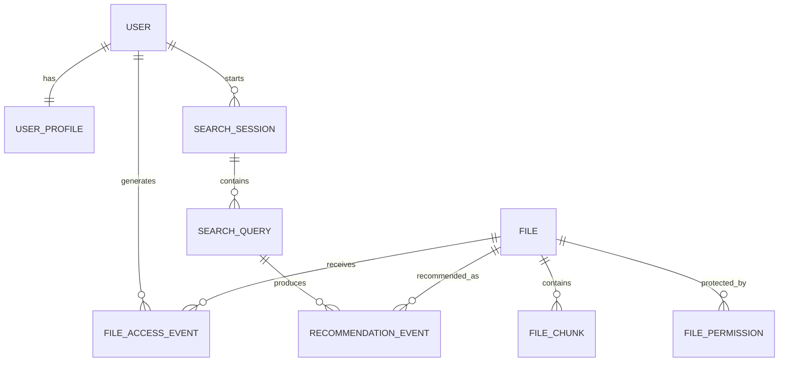

In the current local implementation, `USER_PROFILE` is derived from `FILE_ACCESS_EVENT` records at request time rather than persisted as a separate table. The profile API exposes aggregate file, extension, topic, and UTC activity-time preferences.

Each personalized search persists a `RECOMMENDATION_EVENT` with its user, file, query, strategy, and timestamp. The returned event ID accepts a `relevant` or `not_relevant` feedback value, which contributes to subsequent ranking.