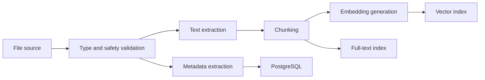

The current local SQLite implementation extracts UTF-8 text from `.txt`, `.md`, and `.rst`, plus text and tables from `.docx` and selectable text from `.pdf`. PDF and DOCX parsers are optional dependencies installed with `pip install -e '.[documents]'`. Files are capped at 1 MiB compressed/source size; extraction is capped at 500,000 characters, PDF processing at 200 pages, and DOCX archives at 20 MiB uncompressed and 2,000 members. Image-only PDFs and empty extracted documents are not indexed.

Extracted text is split into deterministic 1,000-character chunks with 150-character overlap, preferring a nearby word boundary. SQLite FTS5 indexes individual chunks, and optional semantic mode stores a vector per chunk in bounded batches of 64. Content-identical chunks reuse their IDs and cached vectors on re-index. Keyword and semantic candidates are aggregated back to the parent file before ranking and recommendation feedback.