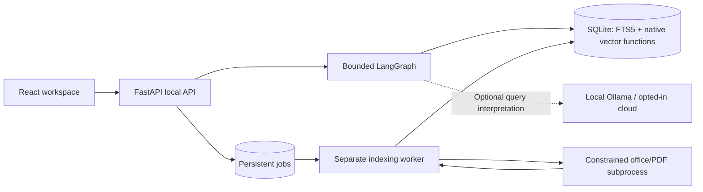

# Local workspace implementation

The delivered scope is a personal Linux browser application for folders and uploads, seven document formats, approximately 10,000 files, local AI by default, recommendations with conversational refinements, and a suggested-files home.

## Components and data flow

- **Storage:** the existing index remains authoritative. Additive `app_*`/source/session/job tables preserve v1 document IDs and ACLs. Foreign keys handle derived file data. Connections close after each transaction, use WAL, and wait for short write contention.
- **Sources:** disallow root/home/app-data folders, overlapping registrations, and symlink roots. Uploads use generated physical names and retain a display-name map.
- **Jobs:** a single worker claims jobs in an immediate transaction. It resumes abandoned jobs at startup, supports cancellation between extraction and embedding batches, and commits one document version at a time.
- **Synchronization:** filesystem events debounce for 1.5 seconds; periodic reconciliation is five minutes. A failed scan never triggers stale-file cleanup. Unsupported/failed files have explicit details; unchanged documents and matching chunk/model embeddings are reused.
- **Extraction:** plain text is processed directly within its size bound. Office/PDF processing runs in a subprocess with a 30-second wall deadline, 25-second CPU limit, and 1 GiB address-space limit on Linux. Sections retain page, slide, sheet, or Markdown headings when available.
- **Vectors:** embeddings are stored as binary floats, versioned by model ID and dimension. `sqlite-vec` cosine-distance functions perform scoped native exact retrieval over stored chunk vectors. This release does not claim an ANN/HNSW index.

## Search graph

Resolve context → interpret → retrieve → evaluate → optional expansion → optional rerank → personalize → explain.

The graph uses typed state and a recursion limit. Application session/turn records persist progress and completed results; interrupted searches are marked on API startup rather than automatically replaying side effects. A fresh search can continue an existing completed conversation. LangGraph's separate checkpoint database is not required for this bounded workflow.

- Explicit source/type/date filters are applied before lexical/vector candidate limits and never overwritten by model proposals. Query understanding receives only query text.
- Retrieve up to 100 candidates per route and aggregate chunks to files. The FTS stage reads up to 400 chunk matches before file aggregation. Fusion and meaningful-term coverage determine query relevance.
- Low-confidence searches attempt one deterministic synonym/stop-word expansion while preserving filters. Reranking is limited to 30 files when a reranker is configured.
- The query LLM has a seven-second request timeout, validated structured output, and deterministic fallback. Later optional work is skipped when the elapsed budget is nearly exhausted. Graph stage boundaries enforce a 30-second deadline; in-process model calls cannot be force-killed mid-inference.
- Personalized scoring considers recorded use, type affinity, feedback, and an explicit working folder; its total adjustment is capped at ±15% of base relevance.
- Explanations cite actual retrieval/personalization signals. No generated answers or document-level summarization is included.

## Browser and API contracts

`/api/v1/bootstrap` establishes a generated HttpOnly/SameSite local cookie and returns a request token for mutations. Host and Origin are checked. Existing static/OIDC modes keep the legacy API and disable the personal workspace API.

| Resource | Contracts |
| --- | --- |
| `/sources`, `/sources/{id}` | List/register, pause/resume, remove; `/sync` queues indexing |
| `/uploads` | Multipart batch of 1–30 supported files, accepted/rejected details |
| `/jobs`, `/jobs/{id}` | Status, counters, bounded per-file details; `/cancel`, `/retry`, `/events` |
| `/sessions`, `/sessions/{id}` | Create/list/read conversations; POST `/turns` submits queries/filters |
| `/turns/{id}` | Durable status/result; `/events` SSE; `/cancel` |
| `/files`, `/files/{id}` | Paginated metadata; extracted `/preview`; guarded `/download` |
| `/recommendations`, `/feedback` | Activity-based home suggestions and recommendation-scoped relevance feedback |
| `/settings`, `/models` | Preferences, model diagnostics, explicit setup jobs |
| `/backup`, `/restore`, `/health` | Consistent local archives, verified restore, readiness and counts |

Search responses expose request/session IDs, effective filters, file IDs, excerpts, section citations, signal explanations, impression IDs, and retrieval diagnostics. SSE sends typed `progress` and `complete` events; HTTP polling recovers from disconnects. The frontend sanitizes document text by rendering it as text rather than HTML.

## Privacy and recovery

History is optional and expires after 30 days. With history disabled, query/effective-query text is not persisted; bounded in-memory context supports follow-ups, and metadata-only ephemeral sessions are later removed. Operational audit metadata excludes model rationales to avoid accidentally recording echoed queries. Graph execution explicitly disables third-party tracing even if the parent shell enables it.

Downloads open file descriptors without following symlinks in any path component and stream from the validated descriptor. Originals are never edited. Source deletion requires active jobs to stop; removing a source does not delete original bytes.

Backup and restore acquire an exclusive operation lock against the worker. Backups use SQLite's backup API and include only completed uploads referenced by the snapshot, omitting cloud credentials. Restore validates member paths, symlink entries, archive limits, manifest version, SQLite integrity, and schema version. Upload paths are remapped to the current data directory; interrupted work is cancelled and cloud reasoning disabled. Folder sources require reconciliation after restore.
